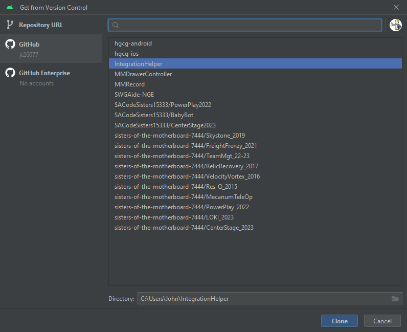

## Connecting Android Studio to Github

In this document, you'll find steps to get Android Studio connected to your Github account for a more user friendly way of using source control.

1. Get from VSC dialog
   1. Without a default project open, you'll receive the following dialog. Choose "Get from VCS".
   2. 
2. Login to Github
   1. On the following dialog, select the 2nd option on the left to log into Github.
   2. 
3. Authorize Jetbrains
   1. If you aren't already logged into Github, take the opportunity now to do so.
   2. Otherwise, you just need to click "Authorize Jetbrains". 
   3. 
4. Authorized Oauth apps
   1. Once you've allowed Android Studio access, you can check the status of all your authorized Oauth apps.
   2. Scroll down to the Integrations section on the left side of your Github account settings.
   3. Select "Applications" to see all your authorized oauth applications 
   4. 
5. Clone Repo
   1. Once you've authorized Android Studio, come back to the "Version Control" dialog.
   2. Select the repository you want to clone and click "Clone". 
   3. 
6. You should now be connected and ready to start contributing to the codebase.