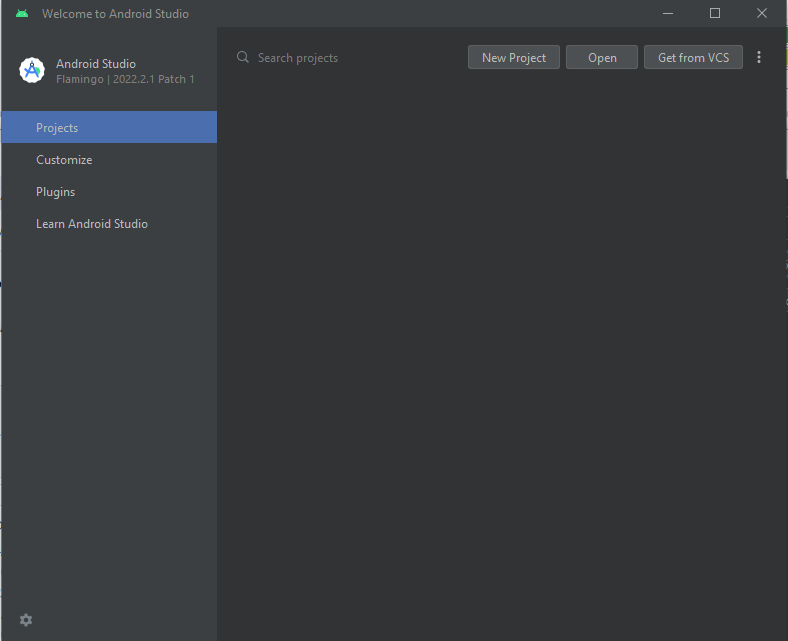
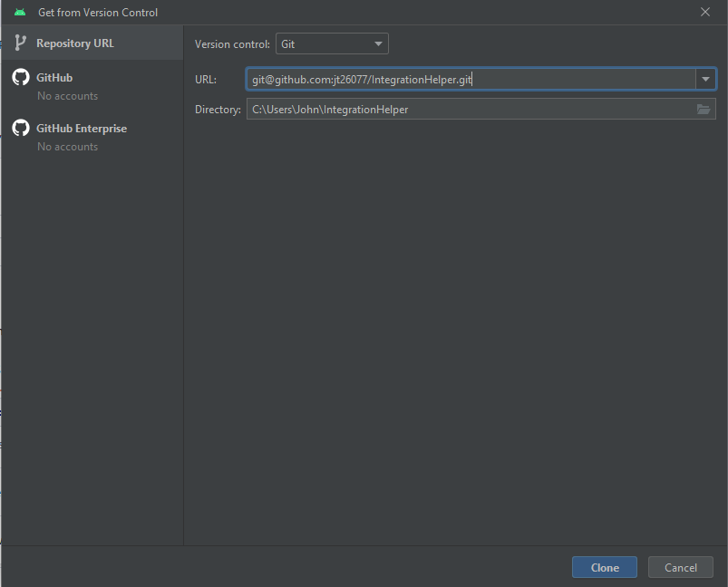
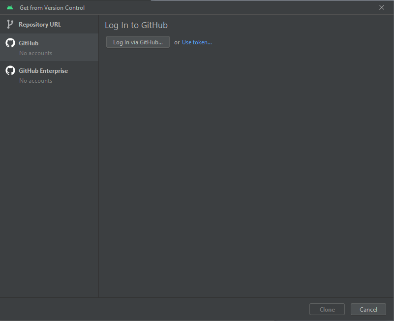
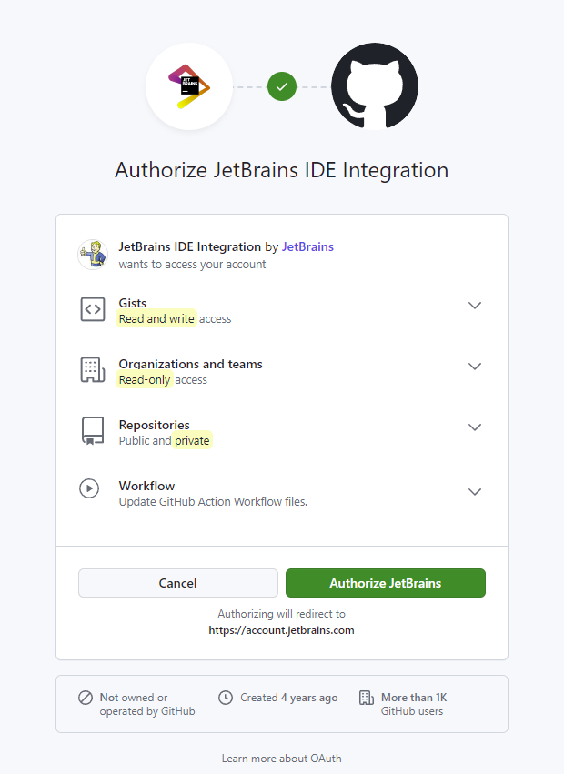

## Connecting Android Studio to Github

In this document, you'll find steps to get Android Studio connected to your Github account for a more user friendly way of using source control.

1. Copy repo link
   1. 
2. Get from VSC dialog
   1. 
3. Clone repo
   1. 
4. Login to Github
   1. 
5. Authorize Jetbrains
   1. 