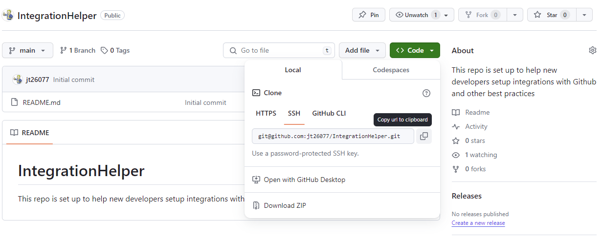
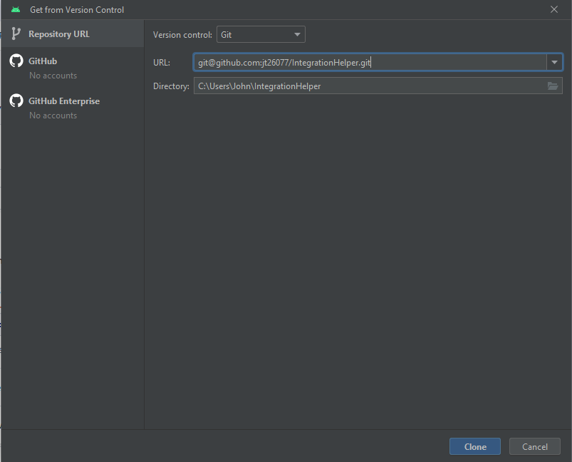

## Set up SSH keys
If you're a software develop looking to contribute to a Github repo, setting up SSH keys to connect your local machine to Github is the most standard process for doing so. Regardless of what operating system you're using, the steps to create a new SSH key on your local machine are fairly similar. Below you'll find steps on how to create new keys for Windows and MacOS.

#### Windows:
Documentation for derived from [SSH authentication for Windows](https://docs.github.com/en/authentication/connecting-to-github-with-ssh/generating-a-new-ssh-key-and-adding-it-to-the-ssh-agent?platform=windows).

#### TL;DR
* `ssh-keygen -t ed25519 -C "your_email@example.com"`
* The default filename is fine, unless you're supporting multiple keys and need something more descriptive
* You can ignore the passphrase unless you're on a shared computer
* `start-ssh-agent` to restart the ssh-agent and pull in your new key
* `clip < C:/User/YOURNAME/.ssh/id_ed25519.pub` to copy this to your clipboard. If you chose a different filename, replace that here

#### MacOS:
Documentation for derived from [SSH authentication for MacOS](https://docs.github.com/en/authentication/connecting-to-github-with-ssh/generating-a-new-ssh-key-and-adding-it-to-the-ssh-agent?platform=mac).

#### TL;DR
* `ssh-keygen -t ed25519 -C "your_email@example.com"`
* The default filename is fine, unless you're supporting multiple keys and need something more descriptive
* You can ignore the passphrase unless you're on a shared computer
* `ssh-add --apple-use-keychain ~/.ssh/id_ed25519`
* `pbcopy < ~/.ssh/id_ed25519.pub` to copy this to your pasteboard. If you chose a different filename, replace that here

## Add your new key to github:
Documentation for derived from [connecting to Github using SSH](https://docs.github.com/en/authentication/connecting-to-github-with-ssh/adding-a-new-ssh-key-to-your-github-account).

TL;DR
* Navigate to your "keys" in [account settings](https://github.com/settings/keys)
* Click "New SSH Key"
* Paste the contents from the previous section into the dialog labeled "Key"
* Give the key a "Title" that makes sense fo you, ie: "My Laptop", "School Computer", etc...
* Click "Add SSH Key"

## Connecting Android Studio
1. Copy repo link
   1. 
2. Get from VSC dialog
   1. 
3. Clone Repo
   1. 